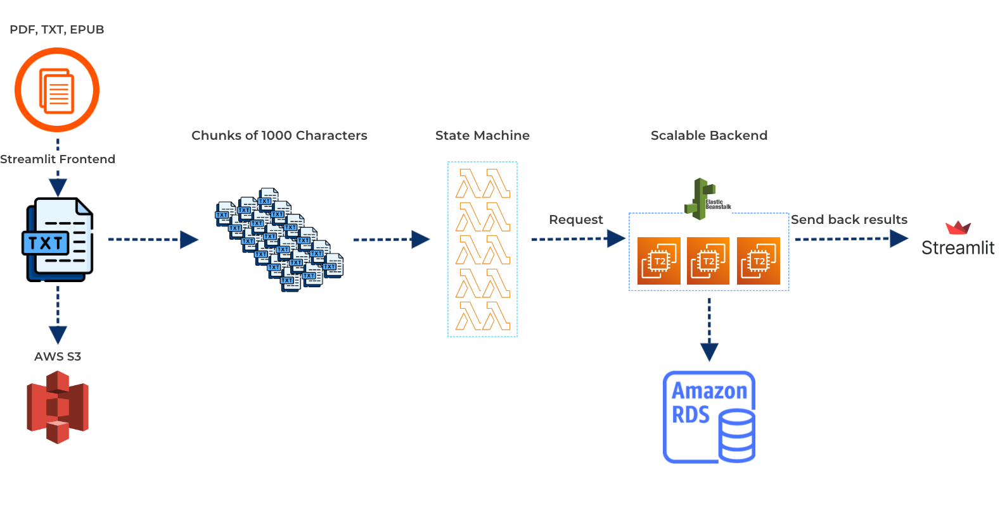

# 
Personalities from Biographies

**
Muhua Huang, Max Zhu
**

## Abstract

Our project aims to create a web application designed to extract Big Five personality traits from historical
biographical texts provided by users. We use Streamlit for an intuitive frontend interface and AWS services (EC2, S3,
RDS, EB) for a scalable and reliable backend infrastructure. We will employ
the [HuggingFace personality detection API](https://huggingface.co/Minej/bert-base-personality) to extract Big Five
personality scores from biographical texts. This approach will provide a novel, quantitative measure to examine the
personalities of notable individuals, assisting social scientists in understanding their behaviors and impacts within
their respective contexts. The application supports input in PDF, TXT, and EPUB formats. While it is recommended to
upload autobiographies for better interpretability, the system can process any document that meets the file type
requirements.

## Features Overview

> **Note** : Due to the 4-hour session limit of AWS Academy, the backend service is not 24/7 available.

- Text Input: Users can input text documents through the Streamlit frontend, which is deployed online and can be
  accessed here: [Personalities from Biographies](https://autobiographypersonality-a4aj4cqoph3wjksiopgbhw.streamlit.app/)
- Personality Traits Extraction: The scalable backend service utilizes a transformer model to extract personality traits from
  the provided text inputs.
- Storage: User inputs are stored in Amazon S3 for persistence and retrieval.
- Data Analysis: Extracted personality traits for each historical figure are stored in Amazon RDS for further analysis
  and insights.

## Social Science Significance

Analyzing personality traits from autobiographies offers social scientists a tool to decode behaviors and identify
patterns across different eras. The Big Five theory categorizes human personality into Openness, Conscientiousness,
Extraversion, Agreeableness, and Neuroticism, providing a robust framework for this analysis. These dimensions have been
extensively validated and are widely accepted in psychology for their ability to describe and predict individual
differences in behavior and cognition. Applying the Big Five theory to biographical texts allows for an analysis on the
personality traits of influential individuals. This approach complements qualitative assessments, offering deeper
insights into historical and cultural shifts. For instance, high levels of Openness and Conscientiousness in leaders may
explain their policies, while high Extraversion and Agreeableness could be linked to charismatic leadership and
diplomacy. Our project helps researchers draw correlations between personality traits and social phenomena, offering
insights into individual disposition's role in history and cross-cultural comparisons.

## Justification for Using Scalable Computing Methods

- The scale of biographical data available for analysis could be vast, encompassing thousands of texts from various
historical periods and cultures. Manual analysis of such a volume of data is impractical and time-consuming. Therefore,
leveraging scalable computing methods is crucial for processing and analyzing these texts. High-performance computing (
HPC) and cloud-based resources allow for the parallel processing of multiple texts and user interactions, reducing the
latency in data extraction and analysis. Additionally, HPC enables the analysis of large datasets.
- **The Pre-trained transformer model can only take in 1024 tokens at a time.**
  To process a large volume of text as biographical texts can contain up to hundreds of thousands of words, we need to
split the text into smaller chunks and process them concurrently. This parallel processing approach is essential for
efficiently extracting personality traits from biographical texts. 

## Methodology and High-Performance Computing Strategy:

1. Parallel Processing: To handle the large volume of biographical texts, we will utilize parallel processing in the AWS Backend.
   There are two components:
    - We divide each input text into 10 chunks and deploy a `step function` in AWS to map 10 `Lambda workers` onto the
      workloads concurrently. By distributing the workloads across multiple processes, we can achieve speed-ups in data
      processing and reduce the overall time required for processing.
    - Each Lambda worker communicates with the Backend service. Currently, we use a single 2-worker `t2` instance of `EC2` to host the
      service using `Gunicorn` and `systemd`. Gunicorn is a **WSGI** HTTP server capable of handling multiple worker
      processes efficiently, which allows it to leverage the multi-cores and serve concurrent incoming requests. `systemd` allows the
      service to auto-restart each time the instance is rebooted, unified logging, and status monitoring
    - We have written the deployment code for `Elastic Beanstalk` (EB), which allows us to autoscale `EC2` instances
      depending on user volume. However, due to the authorization restraint of the AWS Academy account, we have yet to
      initialize an Elastic Beanstalk (EB) application. With a personal account, it should be able to autoscale to multiple `t2` instances.

2. User Interface: To facilitate user interaction with the data, we will develop a frontend dashboard hosted on an
   AWS `EC2 server`. The dashboard will use Streamlit, a framework that allows for the rapid development of interactive
   web applications. This user-friendly interface will enable multiple users to access the service simultaneously,
   explore the data, and gain insights from the personality analysis. The real-time interaction capability of the
   dashboard will enhance the usability and accessibility of the system, making it a valuable tool for social
   scientists.

3. Data Management: Effective data management is essential for the success of our project. We will store the extracted
   personality data, along with the corresponding book titles and names of the individuals, in a `relational database
   system (RDS)`. This approach will prevent redundant computations and streamline data retrieval, making the system
   more   efficient. Additionally, we will store the raw text files in `Amazon S3` for record-keeping and backup purposes. This
   dual approach ensures data integrity and accessibility while maintaining the scalability of the system.

4. User Interface:
    - To facilitate user interaction with the data, we developed a frontend dashboard using `streamlit` a
      Python library that allows for the rapid development of interactive web applications.
    - The `frontend` is deployed on `Streamlit Cloud`, allowing our app to be publicly accessible and allowing multiple
      users to access the service simultaneously.
    - Public access
      link: [Personalities from Biographies](https://autobiographypersonality-a4aj4cqoph3wjksiopgbhw.streamlit.app)
    - > **Note** : The web server is limited by the 4-hour session limit of AWS Academy.

## References

1. John, O. P., Donahue, E. M., & Kentle, R. L. (1991). Big five inventory. Journal of Personality and Social
   Psychology.

